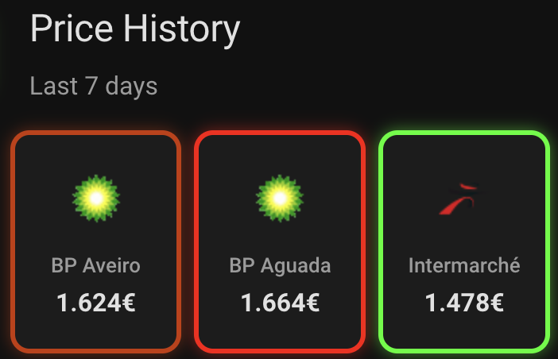
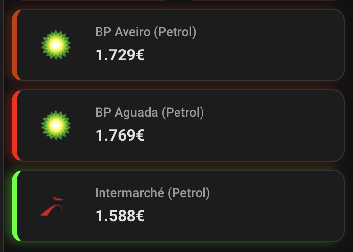

# Preços dos Combustíveis - DGEG

Fuel Prices in Portugal - Custom Component for Home Assistant

The data source for this integration is the [DGEG - Direcção-Geral de Energia e Geologia](https://www.dgeg.gov.pt/).

The author of this project categorically rejects any and all responsibility for the fuel prices presented by this integration.

## Features

- 🏙️ **Organized by City** - One integration entry per city
- ⛽ **Multiple Stations** - Add multiple gas stations per city
- 🔄 **Easy Management** - Add or remove stations anytime via Options
- 📍 **Map Support** - Show stations on your Home Assistant map
- 🖼️ **Brand Logos** - Automatic brand logos for each station
- ⏱️ **Efficient** - Smart data fetching (one API call per station)

## Installation

### HACS (Recommended)

1. Open HACS in your Home Assistant
2. Go to **Integrations**
3. Click the **+** button
4. Search for `Preços dos Combustíveis`
5. Click **Download**
6. Restart Home Assistant

### Manual

1. Download the `custom_components/precoscombustiveis` folder
2. Copy it to your `config/custom_components/` directory
3. Restart Home Assistant

## Configuration

### Method 1: Search by Location (Recommended)

1. Go to **Settings > Devices & Services**
2. Click **+ Add Integration**
3. Search for `Preços Combustíveis`
4. Choose **🔍 Pesquisar por localidade**
5. Select your **District** (Distrito)
6. Select your **City** (Localidade)
7. Select the **Gas Stations** you want to monitor
8. Click **Submit**

The integration will create:

- One entry named `<City>, <District>`
- One device per gas station
- One sensor per fuel type at each station

### Method 2: Add by Station ID

Some gas stations are registered under different locality names in the DGEG database.

In these cases, you can add stations directly by their ID:

1. Go to **Settings > Devices & Services**
2. Click **+ Add Integration**
3. Search for `Preços Combustíveis`
4. Choose **🔢 Adicionar por ID da estação**
5. Enter the **Station ID**
6. Click **Submit**

#### How to Find the Station ID

1. Go to [precoscombustiveis.dgeg.gov.pt](https://precoscombustiveis.dgeg.gov.pt/)

### Adding More Stations

To add more stations to an existing city:

1. Go to **Settings > Devices & Services**
2. Find your city integration
3. Click **Configure** (⚙️)
4. Select additional stations
5. Click **Submit**

### Adding Another City

Simply repeat the configuration process to add stations from another city.

## Sensors

Each gas station creates one sensor per fuel type available at that station. The fuel types vary depending on the station.

### Sensor Attributes

Each fuel sensor includes these attributes:

| Attribute           | Description                 |
| ------------------- | --------------------------- |
| `brand`             | Station brand               |
| `last_price_update` | When price was last updated |
| `last_fetch_at`     | When data was last fetched  |

### Location Tracker

Each station also has a device tracker entity with GPS coordinates that automatically appears on the Home Assistant map.

| Attribute        | Description     |
| ---------------- | --------------- |
| `gas_station_id` | DGEG station ID |
| `station_name`   | Station name    |
| `latitude`       | GPS latitude    |
| `longitude`      | GPS longitude   |
| `address`        | Full address    |
| `station_type`   | Type of station |

## Dashboard Examples

### Fuel Price Card ⭐

A custom Lovelace card designed specifically for this integration with dynamic color coding (green → yellow → red based on price).

|              Vertical Layout               |               Horizontal Layout                |
| :----------------------------------------: | :--------------------------------------------: |
|  |  |

**Features:**

- 🎨 Dynamic color coding based on price comparison
- 🖼️ Automatic brand logos from entity_picture
- 📱 Two layouts (vertical/horizontal)
- 🔧 Visual editor - no YAML needed

📦 **Install:** [fuel-price-card](https://github.com/fcachado/fuel-price-card)

### Other Card Options

| Card                | Description                                     | Documentation                                 |
| ------------------- | ----------------------------------------------- | --------------------------------------------- |
| **Fuel Price Card** | Dynamic color coding based on price comparison  | [📄 View Docs](docs/cards/fuel-price-card.md) |
| **Bar Card**        | Visual comparison with colored progress bars    | [📄 View Docs](docs/cards/bar-card.md)        |
| **Map Card**        | Display station locations on an interactive map | [📄 View Docs](docs/cards/map-card.md)        |
| **Mini Graph Card** | Price history with smooth lines and gradients   | [📄 View Docs](docs/cards/mini-graph-card.md) |
| **Mushroom Chips**  | Compact summary card with price ranges          | [📄 View Docs](docs/cards/mushroom-chips.md)  |

## Migration from v2.x

If you're upgrading from version 2.x, your existing stations will be automatically migrated. The migrated entries will show "(Migrado)" in the name.

You can:

- Keep using the migrated entries as-is
- Delete them and reconfigure using the new city-based system

## Legal Notice

This is a personal project and isn't in any way affiliated with, sponsored or endorsed by [DGEG](https://www.dgeg.gov.pt/).

All product names, trademarks and registered trademarks in this repository are property of their respective owners. All images in this repository are used for identification purposes only.
