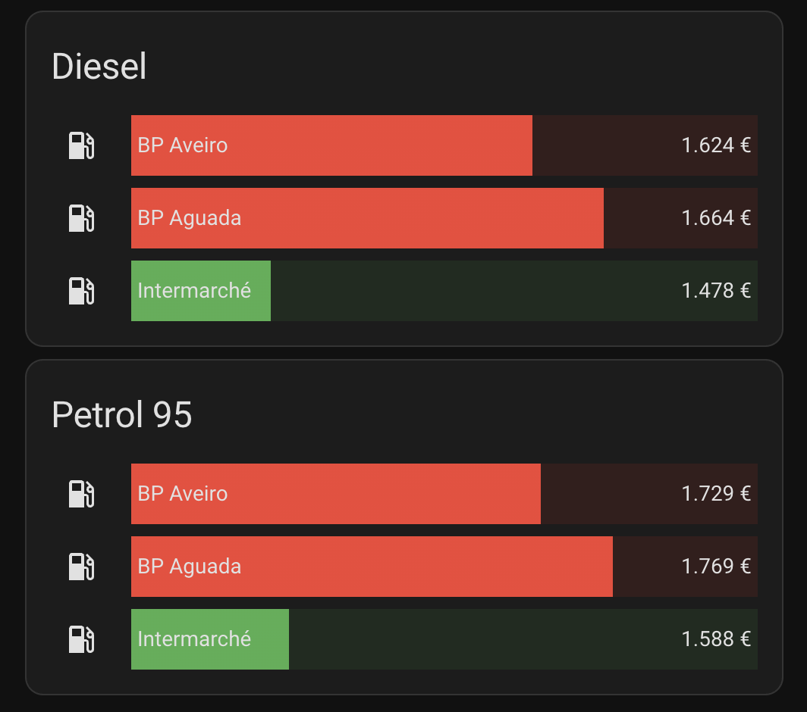

# Bar Card

A visual comparison card with colored progress bars based on price thresholds.



## Features

- 📊 **Visual comparison** - Progress bars show relative prices
- 🎨 **Severity colors** - Define color thresholds (green/yellow/red)
- 📏 **Customizable scale** - Set min/max values for the bars

## Installation

### HACS (Recommended)

1. Open HACS in Home Assistant
2. Go to **Frontend**
3. Search for "bar-card"
4. Click **Download**
5. Reload your browser

### Manual

Add to Lovelace resources:

```yaml
lovelace:
  resources:
    - url: /hacsfiles/bar-card/bar-card.js
      type: module
```

## Configuration

```yaml
type: custom:bar-card
title: Diesel Prices
entities:
  - entity: sensor.bp_aguada_gasoleo_simples
    name: BP Aguada
  - entity: sensor.shell_aguada_gasoleo_simples
    name: Shell
min: 1.5
max: 1.85
severity:
  - color: "#4CAF50"
    from: 0
    to: 1.62
  - color: "#FF9800"
    from: 1.62
    to: 1.70
  - color: "#F44336"
    from: 1.70
    to: 3
```

## Options

| Option     | Type   | Default      | Description                 |
| ---------- | ------ | ------------ | --------------------------- |
| `entities` | list   | **Required** | List of entities to display |
| `title`    | string | none         | Card title                  |
| `min`      | number | 0            | Minimum value for bar scale |
| `max`      | number | 100          | Maximum value for bar scale |
| `severity` | list   | none         | Color thresholds            |

### Entity Options

| Option   | Type   | Description  |
| -------- | ------ | ------------ |
| `entity` | string | Entity ID    |
| `name`   | string | Display name |

### Severity Options

| Option  | Type   | Description            |
| ------- | ------ | ---------------------- |
| `color` | string | Bar color (hex or CSS) |
| `from`  | number | Start value            |
| `to`    | number | End value              |

## Examples

### Traffic Light Colors

```yaml
severity:
  - color: "#4CAF50" # Green
    from: 0
    to: 1.60
  - color: "#FF9800" # Orange
    from: 1.60
    to: 1.75
  - color: "#F44336" # Red
    from: 1.75
    to: 3
```

### Side by Side Comparison

```yaml
type: horizontal-stack
cards:
  - type: custom:bar-card
    title: Diesel
    entities:
      - entity: sensor.station_1_gasoleo_simples
        name: Station 1
      - entity: sensor.station_2_gasoleo_simples
        name: Station 2
    min: 1.5
    max: 2.0

  - type: custom:bar-card
    title: Petrol
    entities:
      - entity: sensor.station_1_gasolina_simples_95
        name: Station 1
      - entity: sensor.station_2_gasolina_simples_95
        name: Station 2
    min: 1.6
    max: 2.1
```
