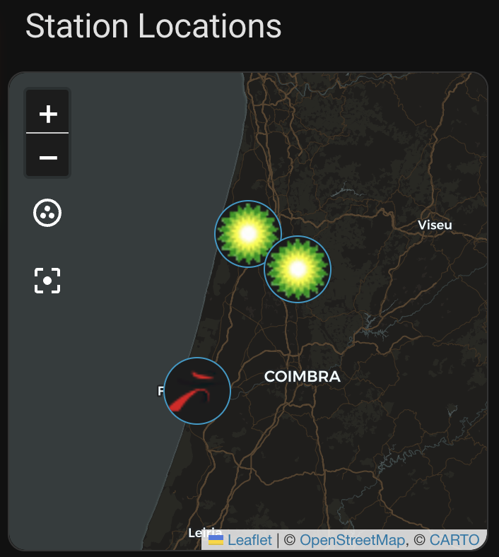

# Map Card

Display gas station locations on an interactive map using device trackers.



## Features

- 🗺️ **Interactive map** - Pan and zoom to explore stations
- 📍 **Station markers** - Each station shown with its name
- 🏠 **Zone support** - Show home zone for reference
- 🌙 **Dark mode** - Automatic or forced dark/light map

## Installation

No additional installation required - this is a built-in Home Assistant card.

The integration automatically creates device tracker entities for each station.

## Configuration

```yaml
type: map
title: Station Locations
default_zoom: 12
entities:
  - entity: device_tracker.bp_aguada_location
    name: BP Aguada
  - entity: device_tracker.shell_aguada_location
    name: Shell
```

## Options

| Option          | Type    | Default      | Description                          |
| --------------- | ------- | ------------ | ------------------------------------ |
| `entities`      | list    | **Required** | List of device tracker entities      |
| `title`         | string  | none         | Card title                           |
| `default_zoom`  | number  | 14           | Initial zoom level                   |
| `dark_mode`     | boolean | auto         | Force dark/light map                 |
| `hours_to_show` | number  | 0            | Show location history (0 = disabled) |

### Entity Options

| Option   | Type   | Description           |
| -------- | ------ | --------------------- |
| `entity` | string | Device tracker entity |
| `name`   | string | Display name on map   |

### Zoom Levels

| Level | Description    |
| ----- | -------------- |
| 5     | Country level  |
| 8     | Region level   |
| 10    | City level     |
| 12    | District level |
| 14    | Street level   |
| 16    | Building level |

## Examples

### With Home Zone

```yaml
type: map
default_zoom: 11
entities:
  - entity: zone.home
  - entity: device_tracker.bp_aguada_location
    name: BP Aguada
  - entity: device_tracker.shell_aguada_location
    name: Shell
```

### Device Tracker Entities

The integration creates these entities automatically:

| Entity Pattern                              | Description      |
| ------------------------------------------- | ---------------- |
| `device_tracker.<brand>_<station>_location` | Station location |

**Examples:**

- `device_tracker.bp_aguada_de_baixo_oeste_location`
- `device_tracker.shell_aguada_de_baixo_n_s_poente_location`

### Device Tracker Attributes

| Attribute      | Description                           |
| -------------- | ------------------------------------- |
| `latitude`     | GPS latitude                          |
| `longitude`    | GPS longitude                         |
| `source_type`  | Always `gps`                          |
| `address`      | Station address                       |
| `station_type` | Type (e.g., "Posto de abastecimento") |
