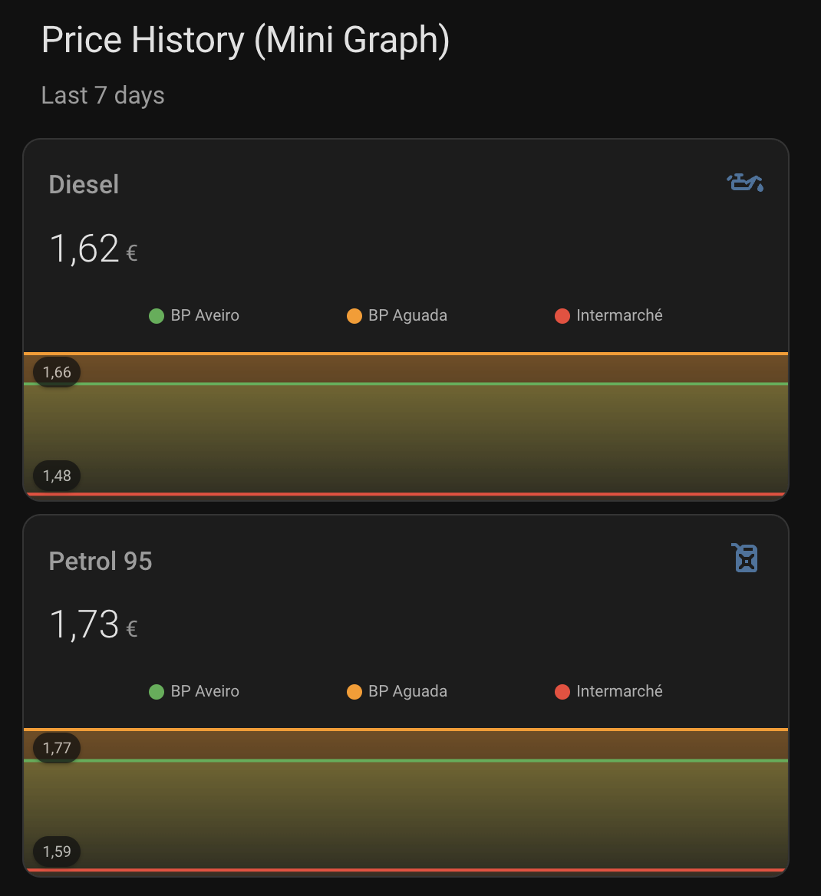

# Mini Graph Card

A compact graph card showing price history with smooth lines and gradients.



## Features

- 📈 **Price history** - Track price changes over time
- 🎨 **Custom colors** - Define line colors per station
- 📊 **Multiple entities** - Compare stations on same graph
- ✨ **Smooth gradients** - Optional fill under lines

## Installation

### HACS (Recommended)

1. Open HACS in Home Assistant
2. Go to **Frontend**
3. Search for "mini-graph-card"
4. Click **Download**
5. Reload your browser

### Manual

Add to Lovelace resources:

```yaml
lovelace:
  resources:
    - url: /hacsfiles/mini-graph-card/mini-graph-card-bundle.js
      type: module
```

## Configuration

```yaml
type: custom:mini-graph-card
name: Diesel Prices
icon: mdi:oil
entities:
  - entity: sensor.bp_aguada_gasoleo_simples
    name: BP Aguada
    color: "#4CAF50"
  - entity: sensor.shell_aguada_gasoleo_simples
    name: Shell
    color: "#FF9800"
hours_to_show: 168
show:
  legend: true
  fill: fade
```

## Options

| Option            | Type   | Default      | Description                 |
| ----------------- | ------ | ------------ | --------------------------- |
| `entities`        | list   | **Required** | List of entities to display |
| `name`            | string | none         | Card title                  |
| `icon`            | string | none         | MDI icon                    |
| `hours_to_show`   | number | 24           | Hours of history            |
| `points_per_hour` | number | 0.5          | Data points per hour        |
| `line_width`      | number | 5            | Line thickness              |
| `show`            | object | see below    | Display options             |

### Entity Options

| Option   | Type   | Description      |
| -------- | ------ | ---------------- |
| `entity` | string | Entity ID        |
| `name`   | string | Display name     |
| `color`  | string | Line color (hex) |

### Show Options

| Option   | Type    | Default | Description                               |
| -------- | ------- | ------- | ----------------------------------------- |
| `labels` | boolean | false   | Show value labels                         |
| `points` | boolean | false   | Show data points                          |
| `legend` | boolean | true    | Show legend                               |
| `fill`   | string  | `true`  | Fill under line (`true`, `false`, `fade`) |

### Time Periods

| Hours | Description   |
| ----- | ------------- |
| 24    | Last 24 hours |
| 48    | Last 2 days   |
| 168   | Last week     |
| 720   | Last month    |

## Examples

### Brand Colors

```yaml
entities:
  - entity: sensor.bp_station
    color: "#009900" # BP Green
  - entity: sensor.shell_station
    color: "#FFCC00" # Shell Yellow
  - entity: sensor.galp_station
    color: "#FF6600" # Galp Orange
```

### Side by Side Comparison

```yaml
type: horizontal-stack
cards:
  - type: custom:mini-graph-card
    name: Diesel
    icon: mdi:oil
    entities:
      - entity: sensor.station_1_gasoleo_simples
        name: Station 1
        color: "#4CAF50"
      - entity: sensor.station_2_gasoleo_simples
        name: Station 2
        color: "#2196F3"
    hours_to_show: 168

  - type: custom:mini-graph-card
    name: Petrol
    icon: mdi:fuel
    entities:
      - entity: sensor.station_1_gasolina_simples_95
        name: Station 1
        color: "#4CAF50"
      - entity: sensor.station_2_gasolina_simples_95
        name: Station 2
        color: "#9C27B0"
    hours_to_show: 168
```
