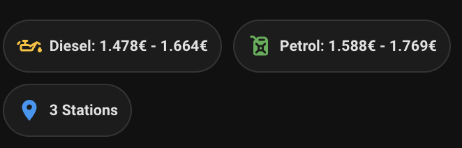

# Mushroom Chips Card

A compact summary card showing price ranges at a glance.



## Features

- 🏷️ **Compact display** - Show multiple values in a row
- 🎨 **Colorful icons** - Easy visual identification
- 📝 **Template support** - Dynamic content with Jinja2
- 👆 **Tap actions** - Navigate to more details

## Installation

### HACS (Recommended)

1. Open HACS in Home Assistant
2. Go to **Frontend**
3. Search for "Mushroom"
4. Click **Download**
5. Reload your browser

### Manual

Add to Lovelace resources:

```yaml
lovelace:
  resources:
    - url: /hacsfiles/lovelace-mushroom/mushroom.js
      type: module
```

## Helper Sensors

This card works best with min/max helper sensors.

📄 **See:** [Helper Sensors Documentation](../helper-sensors.md)

## Configuration

```yaml
type: custom:mushroom-chips-card
chips:
  - type: template
    icon: mdi:oil
    icon_color: amber
    content: "Diesel: {{ states('sensor.gasoleo_simples_min') }}€ - {{ states('sensor.gasoleo_simples_max') }}€"
  - type: template
    icon: mdi:fuel
    icon_color: green
    content: "Petrol: {{ states('sensor.gasolina_95_min') }}€ - {{ states('sensor.gasolina_95_max') }}€"
```

## Options

| Option      | Type   | Default      | Description                               |
| ----------- | ------ | ------------ | ----------------------------------------- |
| `chips`     | list   | **Required** | List of chip configurations               |
| `alignment` | string | `start`      | Chip alignment (`start`, `center`, `end`) |

### Chip Options

| Option       | Type   | Description                             |
| ------------ | ------ | --------------------------------------- |
| `type`       | string | Chip type (`template`, `entity`, etc.)  |
| `icon`       | string | MDI icon name                           |
| `icon_color` | string | Icon color (CSS or HA color name)       |
| `content`    | string | Text content (Jinja2 for template type) |
| `tap_action` | object | Action on tap                           |

### Available Colors

- `red`, `pink`, `purple`, `deep-purple`
- `indigo`, `blue`, `light-blue`, `cyan`
- `teal`, `green`, `light-green`, `lime`
- `yellow`, `amber`, `orange`, `deep-orange`
- `brown`, `grey`, `blue-grey`

## Examples

### Template Chip with Tap Action

```yaml
- type: template
  icon: mdi:gas-station
  icon_color: amber
  content: "{{ states('sensor.fuel_price') }}€"
  tap_action:
    action: more-info
    entity: sensor.fuel_price
```

### Entity Chip

```yaml
- type: entity
  entity: sensor.gasoleo_simples_min
  icon: mdi:arrow-down
  icon_color: green
```

### Full Dashboard Header

```yaml
type: custom:mushroom-chips-card
alignment: center
chips:
  - type: template
    icon: mdi:oil
    icon_color: amber
    content: "Diesel: {{ states('sensor.gasoleo_simples_min') }}€"
  - type: template
    icon: mdi:fuel
    icon_color: green
    content: "Petrol: {{ states('sensor.gasolina_95_min') }}€"
  - type: template
    icon: mdi:map-marker
    icon_color: blue
    content: "3 Stations"
```
